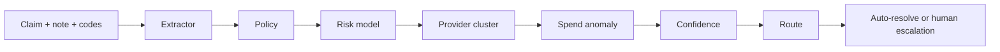

# TPO360

Payment pattern review platform for healthcare claims. Runs each claim through a LangGraph audit pipeline with ML scoring, provider clustering, spend anomaly detection, and human-in-the-loop routing.

**Live app:** https://tpo360.streamlit.app/

---

## What it does

1. **Extract** clinical facts from documentation (Claude)
2. **Validate** billing policy (CPT vs documented time)
3. **Score** payment integrity risk (RandomForest)
4. **Cluster** provider billing patterns (KMeans)
5. **Detect** member spend anomalies (time-series z-score)
6. **Route** to auto-resolve or human escalation with a full audit trace

---

## Run locally

```bash
git clone https://github.com/prashantsonibps/TPO-Pattern-Intelligence-Copilot.git
cd TPO-Pattern-Intelligence-Copilot
python3 -m venv .venv && source .venv/bin/activate
pip install -r requirements.txt
cp .env.example .env   # add ANTHROPIC_API_KEY
streamlit run poc/app.py
```

Open http://localhost:8501 — pick a scenario in the **left sidebar**, click **Run audit**.

---

## Demo scenarios (built in)

| Case | What it shows | Result |
|------|---------------|--------|
| CASE-001 | E/M upcoding (99215, 15 min documented) | Escalated |
| CASE-002 | Home health burst + spend spike | Escalated |
| CASE-003 | Same-day code pairing | Escalated |
| CASE-004 | Clean, documented claim | Auto-resolved |

No upload needed — scenarios ship in `poc/data/demo_cases.json`.

---

## Architecture



| Stage | Technology |
|-------|------------|
| Orchestration | LangGraph state machine |
| Extraction | Anthropic Claude (`claude-sonnet-4-6`) |
| Risk / clusters | scikit-learn |
| UI | Streamlit + Plotly |

---

## Project structure

```
poc/
├── app.py              # UI entry point
├── agent/              # LangGraph pipeline
├── analytics/          # ML models
├── data/               # Synthetic claims + demo cases
├── models/             # Trained .pkl artifacts
└── ui/                 # Layout + Cotiviti branding assets
```

---

## Documentation & media

Place supporting files here:

| File | Path |
|------|------|
| Written report (Word) | `docs/report.docx` |
| Slide deck (PowerPoint) | `docs/presentation.pptx` |
| Demo video (MP4 or link) | `docs/demo.md` — paste your Loom/YouTube URL |

Example `docs/demo.md`:

```markdown
# Demo recording
https://www.loom.com/share/your-link
```

---

## Environment variables

| Variable | Required | Default |
|----------|----------|---------|
| `ANTHROPIC_API_KEY` | Yes (for LLM extraction) | — |
| `ANTHROPIC_MODEL` | No | `claude-sonnet-4-6` |

---

## Data

All claim data is synthetic. No PHI.

---

## License

MIT
