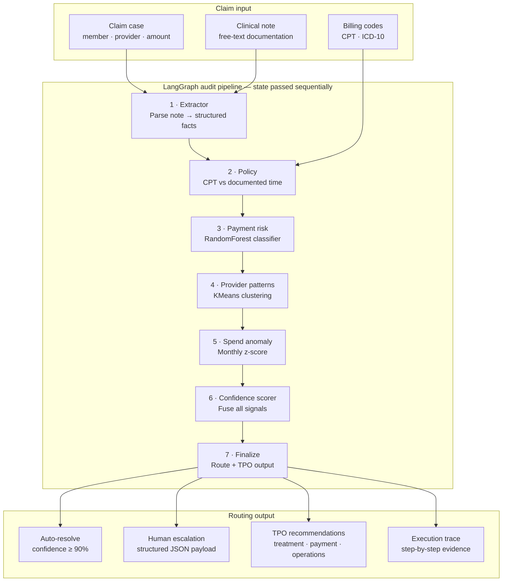

# TPO360

Payment pattern review platform for healthcare claims. Runs each claim through a LangGraph audit pipeline with ML scoring, provider clustering, spend anomaly detection, and human-in-the-loop routing.

**Live app:** https://tpo360.streamlit.app/

**Demo video:** https://www.loom.com/share/8310596baeae4dad8f2f0915478a3953

---

## What it does

1. **Extract** clinical facts from documentation (Claude)
2. **Validate** billing policy (CPT vs documented time)
3. **Score** payment integrity risk (RandomForest)
4. **Cluster** provider billing patterns (KMeans)
5. **Detect** member spend anomalies (time-series z-score)
6. **Route** to auto-resolve or human escalation with a full audit trace

---

## Run locally

```bash
git clone https://github.com/prashantsonibps/TPO-Pattern-Intelligence-Copilot.git
cd TPO-Pattern-Intelligence-Copilot
python3 -m venv .venv && source .venv/bin/activate
pip install -r requirements.txt
cp .env.example .env   # add ANTHROPIC_API_KEY
streamlit run poc/app.py
```

Open http://localhost:8501 — pick a scenario in the **left sidebar**, click **Run audit**.

---

## Demo scenarios (built in)

| Case | What it shows | Result |
|------|---------------|--------|
| CASE-001 | E/M upcoding (99215, 15 min documented) | Escalated |
| CASE-002 | Home health burst + spend spike | Escalated |
| CASE-003 | Same-day code pairing | Escalated |
| CASE-004 | Clean, documented claim | Auto-resolved |

No upload needed — scenarios ship in `poc/data/demo_cases.json`.

---

## Architecture

A claim enters with clinical documentation and billing codes. LangGraph passes **shared state** through seven nodes in order. Each step appends to an **execution trace** so every decision is auditable. The pipeline ends with either **auto-resolve** or **human escalation** plus TPO recommendations.



> **How to read this:** Follow the numbered nodes top-to-bottom. Inputs feed the first two stages. Every later stage reads from shared graph state. The final node writes all four outputs — only one routing path (auto vs human) applies per claim.

### Pipeline walkthrough

Click each stage to see what it does, what it reads, and what it writes.

<details>
<summary><strong>Claim input</strong> — what enters the graph</summary>

| Field | Example | Used by |
|-------|---------|---------|
| Claim case | Member `M-1001`, provider `P-231`, $285 | Risk, cluster, anomaly nodes |
| Clinical note | *"Patient seen for 15 minutes…"* | Extractor |
| CPT / ICD-10 | `99215` / `I10` | Policy, Extractor |

All demo scenarios are pre-loaded in the app sidebar — no manual upload.

</details>

<details>
<summary><strong>1 · Extractor</strong> — clinical fact extraction (LLM)</summary>

**Purpose:** Turn free-text clinical documentation into structured facts.

**Technology:** Anthropic Claude (`claude-sonnet-4-6`) with regex fallback if API is unavailable.

**Reads:** Clinical note, billed CPT code.

**Writes:** `documented_minutes`, complexity level, chief complaint, key phrases.

**Example:** Note says *"seen for 15 minutes"* → extractor outputs `documented_minutes: 15`.

</details>

<details>
<summary><strong>2 · Policy</strong> — billing policy validation</summary>

**Purpose:** Compare extracted facts against CPT time and complexity requirements.

**Technology:** Deterministic rules (CPT time thresholds in `config.py`).

**Reads:** CPT code, documented minutes from Extractor, clinical note.

**Writes:** `policy_result`, list of violations, policy score (0–100).

**Example:** CPT `99215` requires ~40 min but note documents 15 → **policy violation**.

</details>

<details>
<summary><strong>3 · Payment risk</strong> — prepay integrity classifier</summary>

**Purpose:** Score how likely this claim is suspicious relative to historical patterns.

**Technology:** scikit-learn RandomForest trained on synthetic claim features.

**Reads:** Claim fields + member/provider history from `claims.csv`.

**Writes:** Payment risk score (0–100%), top contributing features.

**Example:** High E/M code + time deficit + provider outlier → risk score **87%**.

</details>

<details>
<summary><strong>4 · Provider patterns</strong> — billing behavior clustering</summary>

**Purpose:** Place the provider in a peer cluster to flag aberrant billing styles.

**Technology:** KMeans on provider features (E/M ratio, volume, code diversity).

**Reads:** Provider ID → historical claims for that provider.

**Writes:** Cluster label (e.g. *High E/M Utilization*), risk note.

**Example:** Provider `P-231` matches cluster with elevated high-complexity E/M usage.

</details>

<details>
<summary><strong>5 · Spend anomaly</strong> — member time-series detection</summary>

**Purpose:** Detect unusual spikes in a member's monthly claim spend.

**Technology:** Rolling z-score on monthly aggregated allowed amounts.

**Reads:** Member ID → monthly spend timeline from claim history.

**Writes:** Anomaly flag, z-score, chart-ready timeseries data.

**Example:** CASE-002 shows a sudden home-health billing burst in one month.

</details>

<details>
<summary><strong>6 · Confidence scorer</strong> — signal fusion and routing decision</summary>

**Purpose:** Combine policy, risk, cluster, and anomaly signals into one routing confidence.

**Technology:** Weighted scoring logic (not a black-box LLM decision).

**Reads:** Outputs from nodes 2–5.

**Writes:** Confidence score, route decision (`auto_resolve` or `human_escalation`).

**Rule of thumb:** Policy violation or high risk → escalate. Clean claim with low risk → auto-resolve at ≥ 90%.

</details>

<details>
<summary><strong>7 · Finalize</strong> — TPO output and escalation payload</summary>

**Purpose:** Produce the final business actions and analyst-ready evidence.

**Writes:**
- **TPO recommendations** — Treatment, Payment, Operations actions
- **Escalation JSON** — violations, risk score, cluster, anomaly flag, evidence chain
- **Execution trace** — all seven steps with summaries (visible in the app)

</details>

<details>
<summary><strong>Routing output</strong> — what the user sees in the app</summary>

| Output | When | Where in app |
|--------|------|--------------|
| Auto-resolve banner | Confidence ≥ 90%, low risk, policy compliant | Green banner (try CASE-004) |
| Human escalation banner | Violations, high risk, or anomaly | Yellow banner (try CASE-001) |
| TPO recommendations | Every run | **TPO output** tab |
| Escalation JSON | Escalated claims only | **Escalation JSON** tab |
| Execution trace | Every run | **Execution trace** tab |

</details>

### Tech stack

| Layer | Tool |
|-------|------|
| Orchestration | LangGraph `StateGraph` — [`poc/agent/graph.py`](poc/agent/graph.py) |
| LLM extraction | Anthropic Claude |
| ML | scikit-learn (RandomForest + KMeans) |
| UI | Streamlit + Plotly |
| Data | Synthetic claims in `poc/data/` |

---

## Project structure

```
poc/
├── app.py              # UI entry point
├── agent/              # LangGraph pipeline
├── analytics/          # ML models
├── data/               # Synthetic claims + demo cases
├── models/             # Trained .pkl artifacts
└── ui/                 # Layout + Cotiviti branding assets
```

---

## Documentation & media

| Deliverable | Path |
|-------------|------|
| Demo video | [docs/demo.md](docs/demo.md) — [Loom](https://www.loom.com/share/8310596baeae4dad8f2f0915478a3953) |
| Written report | [docs/tpo360report1.pdf](docs/tpo360report1.pdf) |
| Slide deck | [docs/TPO360-Prepay-Pattern-Intelligence-Copilot.pptx](docs/TPO360-Prepay-Pattern-Intelligence-Copilot.pptx) |

See [docs/README.md](docs/README.md) for all deliverables.

---

## Environment variables

| Variable | Required | Default |
|----------|----------|---------|
| `ANTHROPIC_API_KEY` | Yes (for LLM extraction) | — |
| `ANTHROPIC_MODEL` | No | `claude-sonnet-4-6` |

---

## Data

All claim data is synthetic. No PHI.

---

## License

MIT
