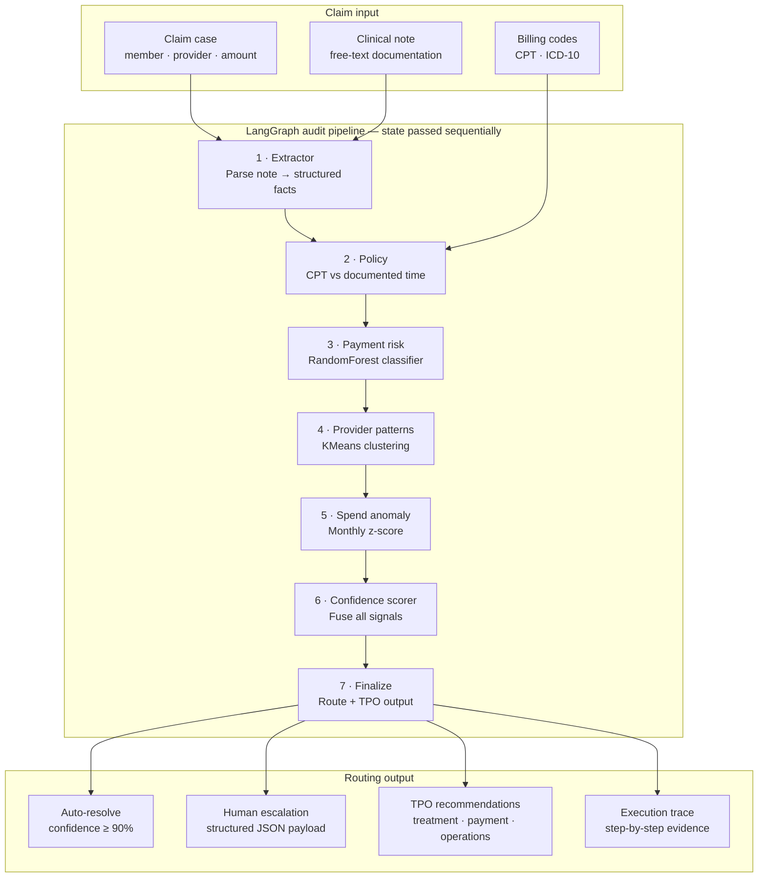

# TPO360

Prepayment claim review copilot for healthcare payment integrity. Each claim runs through a LangGraph audit pipeline — LLM extraction, policy checks, ML risk scoring, and human-in-the-loop routing — with a full execution trace.

**Live app:** https://tpo360.streamlit.app/  
**Demo video:** https://www.loom.com/share/8310596baeae4dad8f2f0915478a3953

---

## 1. Problem

Healthcare payers review millions of claims manually. Analysts must cross-check clinical notes, billing codes, provider history, and member spend — under tight SLAs.

Three gaps this POC targets:

1. **Scale** — manual review cannot keep up with claim volume.
2. **Consistency** — rules and judgment vary across reviewers.
3. **Trust** — fully autonomous AI is risky without auditable evidence and human escalation.

---

## 2. Solution

**TPO360** is an agentic audit workspace that:

1. Extracts facts from clinical documentation (Claude)
2. Validates billing policy (CPT vs documented time)
3. Scores payment integrity risk (RandomForest)
4. Clusters provider billing patterns (KMeans)
5. Detects member spend anomalies (z-score)
6. Routes to **auto-resolve** or **human escalation** with TPO recommendations

Every step is logged. Analysts see *why* a claim was flagged — not just a score.

### Why this fits Cotiviti

1. **Aligns with 360 Pattern Review** — prepay/postpay pattern detection is core Cotiviti work.
2. **Human-in-the-loop by design** — escalates edge cases; does not auto-deny claims.
3. **Auditable pipeline** — execution trace supports compliance and analyst review.
4. **TPO output** — Treatment, Payment, Operations actions map to real client workflows.
5. **Pluggable architecture** — swap rules, models, or LLM without rebuilding the pipeline.

---

## 3. Architecture

A claim enters with clinical notes and billing codes. LangGraph passes **shared state** through seven nodes. The pipeline ends with auto-resolve or human escalation plus TPO recommendations.



> Follow the numbered nodes top-to-bottom. Only one routing path (auto vs human) applies per claim.

---

## 4. Pipeline walkthrough

<details>
<summary><strong>Input</strong> — claim case, clinical note, CPT/ICD-10</summary>

Pre-loaded demo scenarios in the app sidebar. No manual upload.

</details>

<details>
<summary><strong>1 · Extractor</strong> — LLM fact extraction</summary>

Claude parses the clinical note → `documented_minutes`, complexity, chief complaint. Regex fallback if API is offline.

</details>

<details>
<summary><strong>2 · Policy</strong> — billing rule check</summary>

Compares extracted minutes against CPT thresholds. Flags violations (e.g. `99215` billed but only 15 min documented).

</details>

<details>
<summary><strong>3 · Payment risk</strong> — ML classifier</summary>

RandomForest scores claim suspiciousness (0–100%) using claim features + member/provider history.

</details>

<details>
<summary><strong>4 · Provider patterns</strong> — behavior clustering</summary>

KMeans places the provider in a peer cluster (e.g. *High E/M Utilization*) to flag aberrant billing styles.

</details>

<details>
<summary><strong>5 · Spend anomaly</strong> — member spend spike</summary>

Rolling z-score on monthly spend. Flags sudden bursts (e.g. home health volume spike in CASE-002).

</details>

<details>
<summary><strong>6 · Confidence scorer</strong> — signal fusion</summary>

Weighted fusion of policy, risk, cluster, and anomaly signals → confidence score + route decision.

</details>

<details>
<summary><strong>7 · Finalize</strong> — TPO output + escalation payload</summary>

Writes Treatment/Payment/Operations recommendations, escalation JSON, and full execution trace.

</details>

---

## 5. Demo scenarios

| Case | What it shows | Result |
|------|---------------|--------|
| CASE-001 | E/M upcoding (99215, 15 min documented) | Escalated |
| CASE-002 | Home health burst + spend spike | Escalated |
| CASE-003 | Same-day code pairing | Escalated |
| CASE-004 | Clean, documented claim | Auto-resolved |

Pick a case in the sidebar → click **Run audit**.

---

## 6. Tech stack

| Layer | Tool |
|-------|------|
| Orchestration | LangGraph — [`poc/agent/graph.py`](poc/agent/graph.py) |
| LLM | Anthropic Claude (`claude-sonnet-4-6`) |
| ML | scikit-learn (RandomForest + KMeans) |
| UI | Streamlit + Plotly |
| Data | Synthetic claims — no PHI |

---

## 7. Project structure

```
poc/
├── app.py              # Streamlit UI
├── agent/              # LangGraph pipeline
├── analytics/          # ML modules
├── data/               # Synthetic claims + demo cases
├── models/             # Trained .pkl artifacts
└── ui/                 # Theme + branding
```

---

## 8. Documentation & media

| Deliverable | Path |
|-------------|------|
| Demo video | [docs/demo.md](docs/demo.md) |
| Written report | [docs/tpo360report1.pdf](docs/tpo360report1.pdf) |
| Slide deck | [docs/TPO360-Prepay-Pattern-Intelligence-Copilot.pptx](docs/TPO360-Prepay-Pattern-Intelligence-Copilot.pptx) |

---

## 9. Run locally

```bash
git clone https://github.com/prashantsonibps/TPO-Pattern-Intelligence-Copilot.git
cd TPO-Pattern-Intelligence-Copilot
python3 -m venv .venv && source .venv/bin/activate
pip install -r requirements.txt
cp .env.example .env   # add ANTHROPIC_API_KEY
streamlit run poc/app.py
```

Open http://localhost:8501

| Variable | Required | Default |
|----------|----------|---------|
| `ANTHROPIC_API_KEY` | Yes (LLM extraction) | — |
| `ANTHROPIC_MODEL` | No | `claude-sonnet-4-6` |

---

## License

MIT
