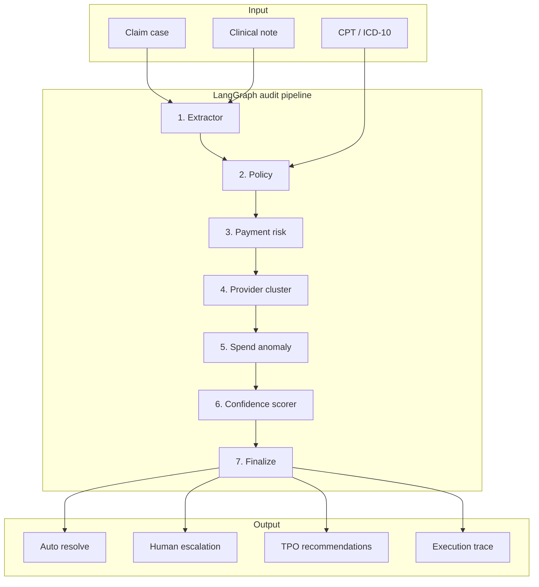

# Clinical Decision Making and Pattern Recognition

Agentic claim audit system for healthcare payment integrity. Combines LangGraph orchestration with classification, provider clustering, and spend anomaly detection across Treatment, Payment, and Operations (TPO).

## Overview

TPO Pattern Intelligence Copilot runs medical claims through a deterministic LangGraph pipeline. Each claim is extracted, validated against billing policy, scored for payment risk, compared to provider billing patterns, and checked for spend anomalies. A confidence router either auto-resolves the claim or escalates it to a human auditor with a structured evidence payload.

Built for prepay review workflows where explainability, audit trails, and human-in-the-loop controls matter as much as automation speed.

## Architecture



<details>
<summary>Text version (if the diagram does not render)</summary>

```
Input: Claim case + clinical note + CPT/ICD-10
  → Extractor → Policy → Payment risk → Provider cluster → Spend anomaly → Confidence scorer → Finalize
Output: Auto resolve OR human escalation + TPO recommendations + execution trace
```

</details>

**Pipeline stages**

| Stage | What it does |
|-------|----------------|
| Extractor | Pulls structured facts from clinical documentation via LLM (regex fallback offline) |
| Policy | Validates billed CPT against documented time and complexity rules |
| Payment Risk | RandomForest classifier scores prepay integrity risk |
| Provider Patterns | KMeans clustering flags aberrant provider billing behavior |
| Spend Anomaly | Z-score detection on monthly member claim spend |
| Confidence Scorer | Fuses all signals into a routing confidence score |
| Finalize | Auto-resolve at ≥90% confidence, or emit escalation JSON for analysts |

## Quick Start

```bash
git clone https://github.com/prashantsonibps/TPO-Pattern-Intelligence-Copilot.git
cd TPO-Pattern-Intelligence-Copilot

python3 -m venv .venv
source .venv/bin/activate
pip install -r requirements.txt

cp .env.example .env
# Add your Anthropic API key to .env:
#   ANTHROPIC_API_KEY=sk-ant-...
#   ANTHROPIC_MODEL=claude-sonnet-4-6

python poc/data/generate_synthetic_data.py
python poc/models/train_models.py
streamlit run poc/app.py
```

Models train automatically on first launch if missing. Sample data ships with the repo.

## Sample Cases

| Case | Scenario | Result |
|------|----------|--------|
| CASE-001 | E/M upcoding — CPT 99215 with 15 min documented | Escalated |
| CASE-002 | Home health billing burst + spend spike | Escalated |
| CASE-003 | Same-day high E/M + home visit pairing | Escalated |
| CASE-004 | Properly documented moderate visit | Auto-resolved |

## Project Layout

```
poc/
├── app.py                  # Streamlit UI
├── config.py
├── agent/
│   ├── graph.py            # LangGraph state machine
│   ├── nodes.py            # Pipeline nodes
│   ├── state.py            # Graph state schema
│   └── tools.py            # Extraction, policy, scoring
├── analytics/
│   ├── classifier.py       # Payment risk model
│   ├── clustering.py       # Provider pattern clusters
│   └── anomaly.py          # Spend anomaly detection
├── data/                   # Synthetic claims + sample cases
└── models/                 # Trained model artifacts
```

## Data

All claim data is synthetic. No PHI is used. Record structures follow standard professional claim fields (member, provider, CPT, ICD-10, allowed amount, service date).

## Deployment

This is a **Python Streamlit app** with pre-trained sklearn models and an Anthropic API dependency. It needs a **long-running server process**, not serverless page hosting.

| Platform | Works? | Notes |
|----------|--------|-------|
| **Streamlit Community Cloud** | Yes | Easiest live demo. Connect GitHub, set `ANTHROPIC_API_KEY` in Secrets, main file: `poc/app.py` |
| **Render / Railway / Fly.io** | Yes | Good free-tier options. Deploy as a web service running `streamlit run poc/app.py --server.port $PORT --server.address 0.0.0.0` |
| **AWS (App Runner, ECS, EC2)** | Yes | Best if you want enterprise hosting. Package with Docker, inject secrets via env vars or AWS Secrets Manager |
| **Vercel / Netlify** | No | Built for static sites and serverless JS — not a fit for Streamlit + LangGraph |

**Recommendation for your Cotiviti demo:** deploy on **Streamlit Community Cloud** or **Render**. Fast to ship, free tier is enough, and evaluators get a live URL for your video.

**Before going live:**
1. Set `ANTHROPIC_API_KEY` and `ANTHROPIC_MODEL=claude-sonnet-4-6` as environment secrets (never commit `.env`)
2. Ensure `poc/data/*.csv` and `poc/models/*.pkl` are in the repo (already included)
3. Add `--server.address 0.0.0.0` so the host accepts external traffic

**AWS is worth it** only if you need VPC, HIPAA-boundary planning, or Cotiviti-style infra story — overkill for a hackathon POC.

## Stack

- LangGraph — stateful agent pipeline with auditable execution traces
- Anthropic Claude — clinical fact extraction (`claude-sonnet-4-6`)
- scikit-learn — classification and clustering
- Streamlit — interactive audit dashboard
- Plotly — risk gauges and spend charts

## License

MIT
